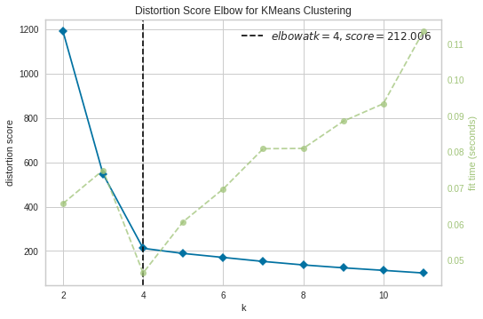

# ML-Assn-2
Author: Jacob Craiglow (craiglowj16@students.ecu.edu)

Quick Start:
  Ensure SciKit Learn and YellowBrick are installed. 
  
  Run the program via: 'python ml_assn2_KMeans.py' 
  
  The program will print an elbow chart showing the best value for K.
  It will then display the accuracy of the KMeans model. 
  Finally, it displays the confusion matrix pertaining to the model. 

KElbowVisualizer:
  
  Here we see the best K is 4. This is inline with our simulated data where we set n_clusters to 4.
  
Sample Confusion Matrix:  
  X    0  1  2  3  
  0  [ 0  0  0 75]  
  1  [75  0  0  0]  
  2  [ 0  0 75  0]  
  3  [ 0 75  0  0]  
 
 This is an interesting graph. It is telling us we have an accuracy of 25%
 And we do. However, being that the data our model predicted is neatly grouped into non-overlapping groups of four
 indicates that there is some fundamental problem. With the exception of cluster 2, it seems the other three groups have 
 been mislabeled as a whole. Meaning, instead of there being a problem with the models predictive accuracy, there is a problem
 where the model assigns the names of the labels. This is almost certainly the explanation for my model producing accuracies of 
 only 0%, 25%, 50%, and 100%.
